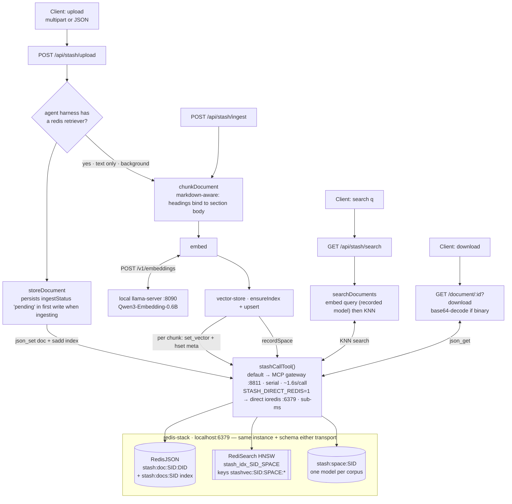
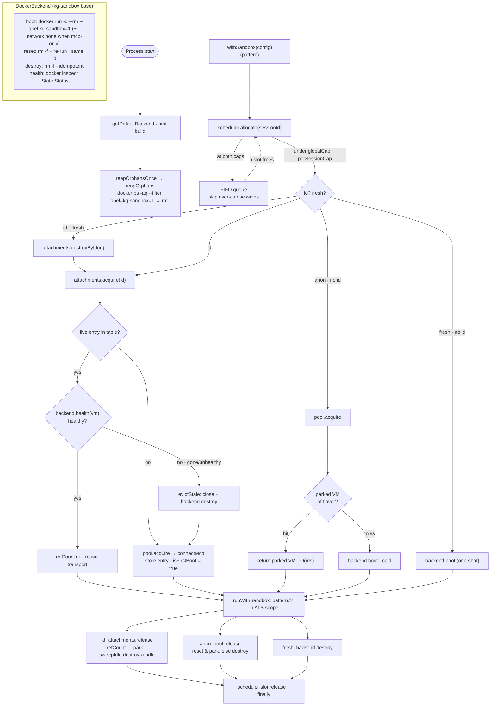
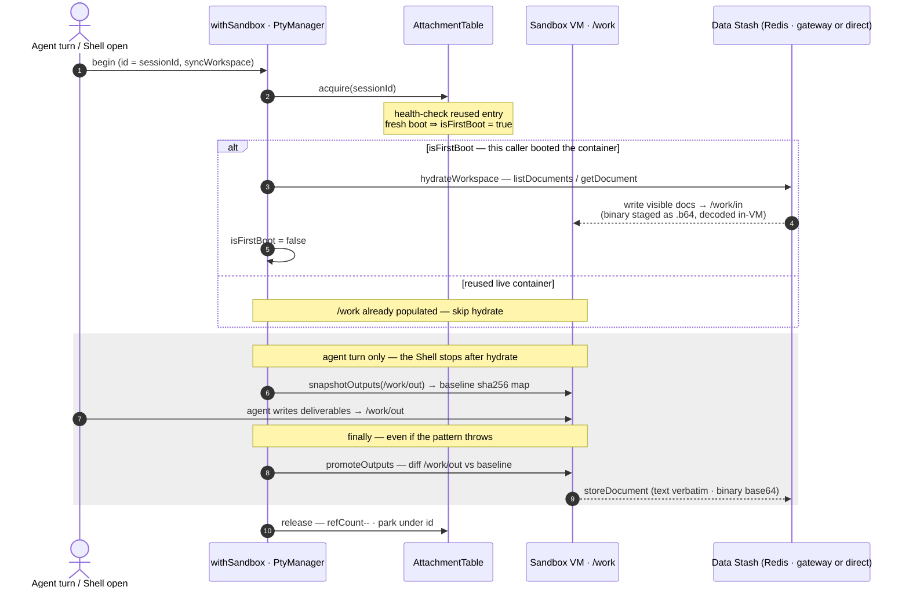
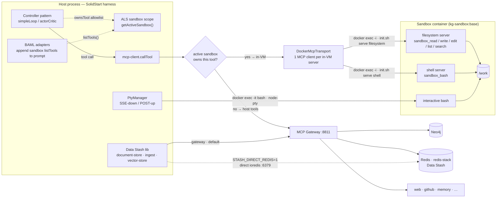

# Data Flow — Data Stash & Sandbox

Visual companion to [`DATA_STASH.md`](DATA_STASH.md) (the store → chunk → embed →
search pipeline) and the sandbox docs [`plan/sandbox.md`](plan/sandbox.md) /
[`sandbox/README.md`](sandbox/README.md). Those cover the *what* and *why* in
prose; this doc is the *how data moves* at a glance — four Mermaid diagrams
covering the two subsystems and the bridge between them.

The diagrams reflect the code as of the durable-workspace (#89), retriever +
direct-Redis (#102 / #111) and attachment-lifecycle (#97) merges. When they
drift from the source, the source wins — every box maps to a named function in
`ui/src/lib/`.

**Reading the diagrams**

- `SID` / `DID` = a session id / document id; `SPACE` = the embedding-space tag
  (`provider_model_dim`) baked into vector index + key names so one index never
  mixes models.
- Cylinders are Redis keyspaces; the double-bordered box is the RediSearch vector
  index — all in one redis-stack. The Data Stash reaches it via `stashCallTool()`:
  the **MCP Gateway** (`:8811`) by default, or a **direct `ioredis` socket** when
  `STASH_DIRECT_REDIS=1` (#111). Agentic MCP tool calls always go through the
  gateway.

---

## 1. Data Stash pipeline (#6 / #9 / #8)

Upload stores a document in RedisJSON; text documents can additionally be
**chunked → embedded → indexed** for KNN search. Ingest runs two ways:
explicitly (`POST /api/stash/ingest`) or automatically on upload when the
session's agent composes a `retriever` wired to the redis backend
(`harnessHasRedisRetriever`). Binary uploads (base64) are stored + downloadable
but never ingested — the text pipeline can't chunk raw bytes.

**Notes**

- `storeDocument` writes the doc (`json_set`, 7-day TTL) *and* registers it in
  the per-session index set (`sadd`, TTL refreshed). The index self-heals:
  `listDocuments` prunes ids whose doc key has expired.
- One embedding space per session corpus: `recordSpace` stamps
  `stash:space:SID`; re-ingesting under a different model throws unless
  `allowSpaceChange`, and queries are always embedded with the *recorded* model
  (`assertSameSpace`) — a search can never compare across spaces.
- Auto-ingest is best-effort and decoupled from the upload's `201`: the gate is
  decided *before* the first write, so `ingestStatus: 'pending'` is persisted in
  that write (kills the status-flicker), then embedding runs in the background. A
  retriever also runs `ensureSessionIngested` on first search as a safety net for
  uploads that predated the agent being known.
- Vectors live in RediSearch HNSW (COSINE); requires **redis-stack**, and on
  arm64 colima the redis service must run `platform: linux/amd64` (the native
  arm64 `redisearch.so` SIGILLs on vector ops — see `DATA_STASH.md`).
- **Transport (#111).** The Data Stash layer is parameterised on an injectable
  `CallTool`; `stashCallTool()` resolves to the **MCP gateway** (default) or a
  **direct `ioredis`** client (`STASH_DIRECT_REDIS=1`) against the *same*
  redis-stack, with a byte-identical key + FLOAT32 vector schema — so a corpus can
  mix gateway- and direct-written chunks. The gateway's serial stdio pipe is
  ~1.6s/call, so ingest (still a sequential 2-writes-per-chunk loop) drops from
  ~200s to <1s on the direct client: the win is per-call latency, not fewer
  writes. Only Data Stash modules use this — agentic MCP tools keep the gateway.
- The agent-facing `retriever` pattern reuses this search path (its `redis`
  backend calls `searchDocuments`), rather than a tool-calling loop — one embed +
  KNN. See [`DATA_STASH.md`](DATA_STASH.md).

---

## 2. Sandbox attachment lifecycle (#79 / #97)

`withSandbox(config)(pattern)` attaches a VM to a controller for its lifetime.
Every call clears the scheduler cap first, then takes one of four acquire paths
picked by `id` / `fresh`. The id-addressable path (used by **Sandbox · Session**)
is the interesting one: it reuses one live container across a conversation's
turns, ref-counted, with a liveness check before reuse.

The two #97 hardening points are called out: the **startup orphan reaper**
(clears containers a crashed prior process leaked) and the **reuse health-check**
(a container that died between turns is torn down and re-booted transparently).

**Notes**

- **Scheduler** gates *whether* a sandbox may exist (`globalCap` +
  `perSessionCap`); the **warm pool** decides *where it comes from* (parked VM vs
  cold boot). `withSandbox` always allocates the slot first and releases it in
  the outer `finally`, regardless of branch.
- The reaper is label-scoped (`kg-sandbox=1`) and fires once per process,
  fire-and-forget, before the first acquire. Caveat: it removes *all* labelled
  containers, so it's correct for single-process dev but would need a grace
  window if multiple harness processes ever shared one Docker host (#97).
- The health-check costs ~1 `docker inspect` per reuse. On a non-healthy verdict
  the stale entry is torn down via `backend.destroy` (not `pool.release` — the
  container is already dead, nothing to recycle), and the fresh boot comes back
  with `isFirstBoot = true` so the durable-workspace path re-hydrates `/work`
  transparently (see diagram 3).
- `reset` keeps the logical sandbox `id` stable across a warm-pool recycle — only
  the container underneath changes — so the id shown in the UI terminal prompt
  is stable across turns.

---

## 3. Durable workspace — `/work` ⇄ Data Stash (#89 / #97 Gap 3)

This is the bridge between the two subsystems. When an id-addressable sandbox
opts into `syncWorkspace`, the session's stored documents are **hydrated** into
`/work/in` on the first boot, and files the agent writes under `/work/out` are
**promoted** back to the Data Stash on each turn's exit — so deliverables survive
container eviction and show up in the DataStash UI.

The interactive Shell (#97 Gap 3) shares the same attachment, so if a user opens
a terminal *before* the agent's first turn, the Shell hydrates `/work/in` itself.
The shared `Attachment.isFirstBoot` flag coordinates: whoever boots the container
first hydrates; the other skips.

**Notes**

- Hydration writes only *visible* docs (hidden/archived are skipped, matching
  their exclusion from the agent's context elsewhere).
- Promotion is diff-based: `snapshotOutputs` hashes `/work/out` *in-VM* before
  the turn (via `sha256sum`, so unchanged bytes never cross the transport), and
  `promoteOutputs` stores only new/changed files afterward. Deletions are
  ignored — promotion never removes an already-stored document.
- The in-VM MCP filesystem tools are **text-only**, so binary moves as base64
  staged through a `.b64` file that `base64 -d` / `base64 -w 0` decode/encode
  in-VM — never through a bash arg (ARG_MAX) or bash stdout (see
  `work-sync.server.ts`).
- Everything is best-effort per file: one unwritable/unreadable file never
  aborts the turn, and a hydrate failure (e.g. gateway down) never blocks the
  turn or the Shell from opening.
- Hydrate/promote reach the Data Stash through the same `stashCallTool()` as the
  rest of the pipeline — direct `ioredis` when `STASH_DIRECT_REDIS=1`, else the
  gateway (diagram 1).

---

## 4. Sandbox tool dispatch & runtime topology (#79)

How a tool call from a controller reaches either the in-VM MCP servers or the
host gateway, and how the interactive Shell shares the same container. The
`withSandbox` wrapper runs the pattern inside an AsyncLocalStorage scope carrying
the VM's `McpTransport`; three readers consult that scope. Sandbox-owned tool
names (`sandbox_*`) route in-VM; everything else routes to the host gateway (the
same gateway that fronts the Data Stash Redis in diagram 1).

**Notes**

- The three ALS readers: (1) `mcp-client.callTool` routes `sandbox_*` names to
  the in-VM transport instead of the gateway; (2) `simpleLoop` / `actorCritic`
  extend their allowlist guard with `sandbox.ownsTool(...)` so sandbox tools pass
  without being threaded through `tools`; (3) the BAML adapters append the active
  sandbox's `listTools()` to the prompt so the actor sees them on turn one.
- `connectMcp` opens **one MCP client per in-VM server** over `docker exec -i`
  stdio — no container networking is needed, which is why `mcp-only` egress can
  run `--network none`. Native tool names are curated to the six `sandbox_*`
  tools in `V0_IN_VM_SERVERS`.
- The **PTY / Shell** and the **agent** share the same session container: both
  acquire the same `Attachment` (refCount > 0 keeps the VM from being swept while
  a terminal is open). The Shell is a real pseudo-TTY (`docker exec -it … bash`
  via node-pty), fanned out to SSE subscribers with a replayable scrollback.
- `firecracker` is a declared backend kind in the `ComputeBackend` trait but not
  yet implemented (#78) — the same MCP-in-VM architecture and `sandbox_*`
  surface, only the boot/reset substrate differs.
- The **Data Stash** modules reach the same redis-stack either through the gateway
  (default) or a direct `ioredis` socket (`STASH_DIRECT_REDIS=1`, #111); agentic
  MCP tool calls always use the gateway (diagram 1).
