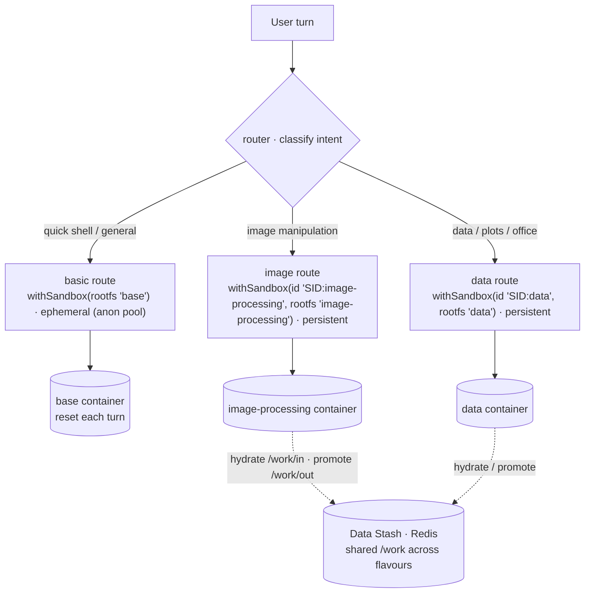

# Sandbox flavours & runtime selection — design note

> **Status:** the `image-processing` + `data` flavours and a router demonstrator
> ship in this PR; the hardening/ergonomics items are tracked in
> [#116](https://github.com/mknw/harness-playground/issues/116). Tracks
> [#78](https://github.com/mknw/harness-playground/issues/78). Companion to
> [`plan/sandbox.md`](plan/sandbox.md) and [`data-flow.md`](data-flow.md)
> (attachment lifecycle + `/work` ⇄ Data Stash).

## Problem

Sandbox v0 shipped one rootfs, `base` ([`rootfs/Dockerfile`](../rootfs/Dockerfile)):
`node:22-bookworm-slim` + `python3`/`pip`/`venv` + `curl` + the two in-VM MCP
servers. No image/data/office tooling, and the default `egress: 'mcp-only'` sets
`--network none` ([`docker-backend.server.ts`](../ui/src/lib/sandbox/docker-backend.server.ts)),
so the actor can't install packages at runtime either. Image processing, data
analysis, and office-document generation were effectively blocked.

## Flavours (this PR)

Two purpose-split flavours, each `FROM kg-sandbox:base`, built by
[`rootfs/build.sh`](../rootfs/build.sh):

| Flavour | Adds | For |
|---|---|---|
| **`image-processing`** | numpy, Pillow, OpenCV (Debian `python3-opencv`) + **imagemagick** | image manipulation |
| **`data`** | pandas, numpy, polars, pyarrow, matplotlib, seaborn + excel backends (openpyxl, fastexcel, xlsxwriter) + python-docx, python-pptx, reportlab, pypdf (via **`uv`**) | data analysis, plots, office/pdf generation |
| **`office`** | python-docx (Word), openpyxl + xlsxwriter (Excel), PyMuPDF (PDF read/edit/create) (via **`uv`**) | editing MS-Office documents & PDFs as deliverables |

Excel backends in `data`: pandas reads/writes xlsx via **openpyxl**; polars'
`read_excel` needs **fastexcel** (the calamine engine); **xlsxwriter** is the
write engine for `pd.ExcelWriter` / `pl.DataFrame.write_excel`.

- **`base` stays the default rootfs;** flavours are opt-in via `withSandbox({ rootfs })`.
- Both keep `sandbox_bash` and `mcp-only` egress (no network) for now.
- **On the `data`/`image-processing` split:** `data` deliberately omits the heavy CV
  libraries (`opencv`/`scikit-image`). Note that **Pillow still arrives in `data`
  transitively** — matplotlib (required by seaborn) hard-depends on it — so the
  split is really "no OpenCV in `data`", not "no Pillow". Truly Pillow-free `data`
  would mean dropping matplotlib/seaborn.
- **Why `image-processing` uses apt, not `uv`:** the `opencv-python` wheel SIGILLs
  on import on arm64/colima (illegal instruction — the same class as the RediSearch
  arm64 crash). Debian's `python3-opencv` (+ matched `python3-numpy`/`python3-pil`)
  is compiled for a baseline ISA and imports cleanly. `data`'s uv wheels don't
  SIGILL, so it stays on `uv`.

## What already existed (the plumbing)

- `RootfsId` is an open string; widened here to `'base' | 'image-processing' | 'data' | (string & {})` ([`types.ts`](../ui/src/lib/sandbox/types.ts)).
- `imageForRootfs` maps `base` → `SANDBOX_IMAGE` and falls through to `kg-sandbox:${rootfs}` — no backend change to add a flavour ([`docker-backend.server.ts`](../ui/src/lib/sandbox/docker-backend.server.ts)).
- `WarmPool` is keyed by rootfs flavour ([`warm-pool.server.ts`](../ui/src/lib/sandbox/warm-pool.server.ts)); caps added for the new flavours in `DEFAULT_SETTINGS.sandbox.warmPool`.

## The composable recipe — router over flavoured sandboxes

`withSandbox(config)(pattern)` returns a `ConfiguredPattern`; `router(name→description)`
+ `routes(name→pattern)` compose them. A route can be a flavoured, sandboxed
controller — so flavour selection lives entirely in the harness. The demonstrator
([`examples/flavoured-sandbox.server.ts`](../ui/src/lib/harness-client/examples/flavoured-sandbox.server.ts)):

```ts
// one ephemeral (base) + two persistent (data, image-processing) routes
const basic = withSandbox({ rootfs: 'base', egress: 'mcp-only', sessionId })(loop)          // ephemeral (anon pool)
const image = withSandbox({ id: `${sessionId}:image-processing`, sessionId,
                            rootfs: 'image-processing', egress: 'mcp-only', syncWorkspace: true })(loop)
const data  = withSandbox({ id: `${sessionId}:data`, sessionId,
                            rootfs: 'data', egress: 'mcp-only', syncWorkspace: true })(loop)

return [
  router({ basic: '…', image_processing: '…', data: '…' }),
  routes({ basic, image_processing: image, data }),
  synthesizer({ mode: 'thread' }),
]
```



Why it fits the current primitives (verified in source):

- **Only the matched route boots.** `routes()` dispatches a single
  `patternMap[routeName]` (`router.server.ts:238`), so only the selected flavour's
  `withSandbox` fn runs → one container per turn, no fan-out.
- **Capabilities flow through composition.** `routes()` exposes
  `children: Object.values(patternMap)` (`router.server.ts:277`) and `withSandbox`
  exposes `children:[pattern]` + stamps its `syncWorkspace` marker — so
  `agentUsesSyncWorkspace` / `agentUsesRedisRetriever` work on a hand-composed agent.

## Ephemerality is orthogonal to flavour

Whether a sandbox is **ephemeral** (`fresh` or the anonymous-pool path — reset per
turn) or **persistent** (`id` + `syncWorkspace` — parked across turns) is a
*per-call* argument, not a property of the flavour. Any flavour can be used either
way, and **multiple persistent flavours can coexist in one session**: use a
flavour-scoped attachment id `id = ${sessionId}:${rootfs}` (distinct container per
flavour) while keeping `sessionId` (the Data Stash key) the conversation id — so
`/work` hydrate/promote is shared across the flavoured containers, only in-VM
scratch differs. `id` and `sessionId` are *separate* `withSandbox` params, so this
works today (the demonstrator does exactly this).

## Deferred (→ [#116](https://github.com/mknw/harness-playground/issues/116))

- **Flavour-in-identity.** Fold the `${id}:${rootfs}` convention *into* `withSandbox`
  so callers can't forget it and silently reuse one container across flavours
  (today `AttachmentTable.acquire` reuses by `id`, ignoring `rootfs`). Ergonomic/safety,
  not a correctness blocker given the convention works now.
- **Flavour-aware Shell.** `PtyManager.start` acquires `(sessionId, 'base')`
  ([`pty-manager.server.ts`](../ui/src/lib/sandbox/pty-manager.server.ts)) — with
  flavour-scoped agent containers the terminal opens a *separate* base box (it still
  hydrates `/work/in` from the shared Data Stash, so it shows promoted deliverables
  but not the flavoured containers' live scratch). Make the tab pick a flavour and
  acquire `${sessionId}:${flavour}` (thread a `flavour` param through the PTY stream
  route, like `agentId`).
- **Guardrails** — per-flavour in-VM tool surface (curate/drop `sandbox_bash`;
  whitelist capabilities, not command substrings), advisory command allow/denylist,
  kernel hardening (`--cap-drop=ALL`, `--read-only` + writable `/work`, non-root
  `USER`, seccomp), and **egress enforcement** (the `pypi`/`github-trusted`/`open`
  profiles are named but not enforced yet) + `uv` live-install with a mounted cache.
  Revisit with the `open` (networked) flavour.

**Avoid overlap:** ingest-side many→markdown *conversion* (pdf/docx/odt → md, for
search) is handled by the `doc-convert` sidecar (see [`DATA_STASH.md`](DATA_STASH.md)
→ Document conversion). These flavours are about *executing code* and *producing*
image/office deliverables — a different axis. The `office` flavour EDITS
docx/xlsx/pdf in-place (python-docx/openpyxl/PyMuPDF); true format *conversion*
(docx↔odt, →pdf via an office engine) still isn't covered — that's a deferred
LibreOffice service, not a flavour (prefer a service over baking it).
